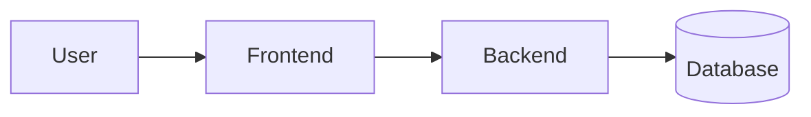
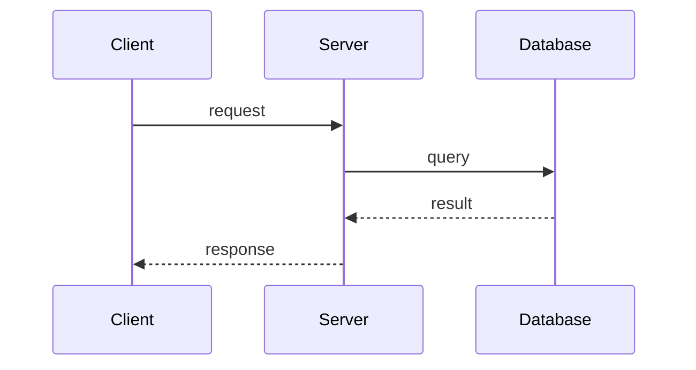
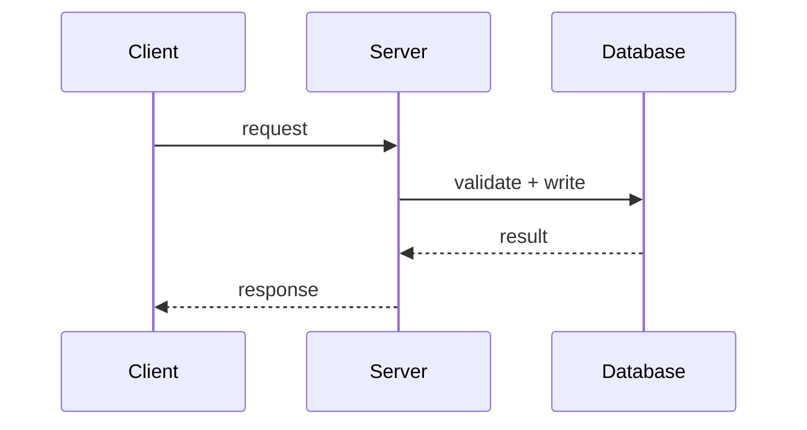

# 02. Architecture

이 문서는 MVP 범위가 어느 정도 확정된 뒤에 채웁니다.

## 1) 기술 스택 선택 이유

| 영역 | 선택 기술 | 선택 이유 | 대안 |
| --- | --- | --- | --- |
| Frontend | [ ] | [ ] | [ ] |
| Backend | [ ] | [ ] | [ ] |
| Database | [ ] | [ ] | [ ] |
| Infra | [ ] | [ ] | [ ] |

## 2) 시스템 구성

간단한 블록 다이어그램이나 Mermaid를 사용합니다.



설명:

- 프론트 역할: [ ]
- 백엔드 역할: [ ]
- 데이터 저장 방식: [ ]

## 3) 레이어 구조

예시:

- Route / Controller: HTTP 요청/응답 처리
- Service: 비즈니스 로직
- Repository: DB I/O
- UI Layer: 화면 렌더링/상호작용

현재 프로젝트 구조:

```text
src-or-app/
├─ api/
├─ services/
├─ models/
├─ templates/
└─ ...
```

## 4) 데이터 모델

핵심 엔티티만 먼저 정리합니다.

### Entity A. [예: User]

| 필드 | 타입 | 설명 | 필수 여부 |
| --- | --- | --- | --- |
| `id` | [ ] | [ ] | Yes |
| `email` | [ ] | [ ] | Yes |
| `nickname` | [ ] | [ ] | Yes |

### Entity B. [예: Meeting]

| 필드 | 타입 | 설명 | 필수 여부 |
| --- | --- | --- | --- |
| `id` | [ ] | [ ] | Yes |
| `title` | [ ] | [ ] | Yes |
| `author_id` | [ ] | [ ] | Yes |
| `status` | [ ] | [ ] | Yes |

## 5) DB 스키마 / 정합성 규칙

- 유니크해야 하는 값: [ ]
- 삭제 시 연관 데이터 처리 방식: [ ]
- 동시성/중복 방지 규칙: [ ]
- 상태 전이 규칙: [ ]

## 6) 핵심 시퀀스 다이어그램

모든 기능을 그리지 말고, 리스크 높은 흐름만 우선 작성합니다.

### Flow A. [예: 로그인]



### Flow B. [예: 예약/참여/결제]



## 7) 운영/배포 메모

- 실행 환경: [ ]
- 환경 변수: [ ]
- 배포 전략: [ ]
- 로깅/모니터링 계획: [ ]