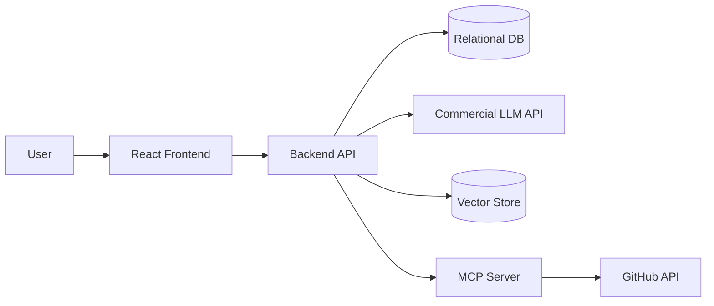
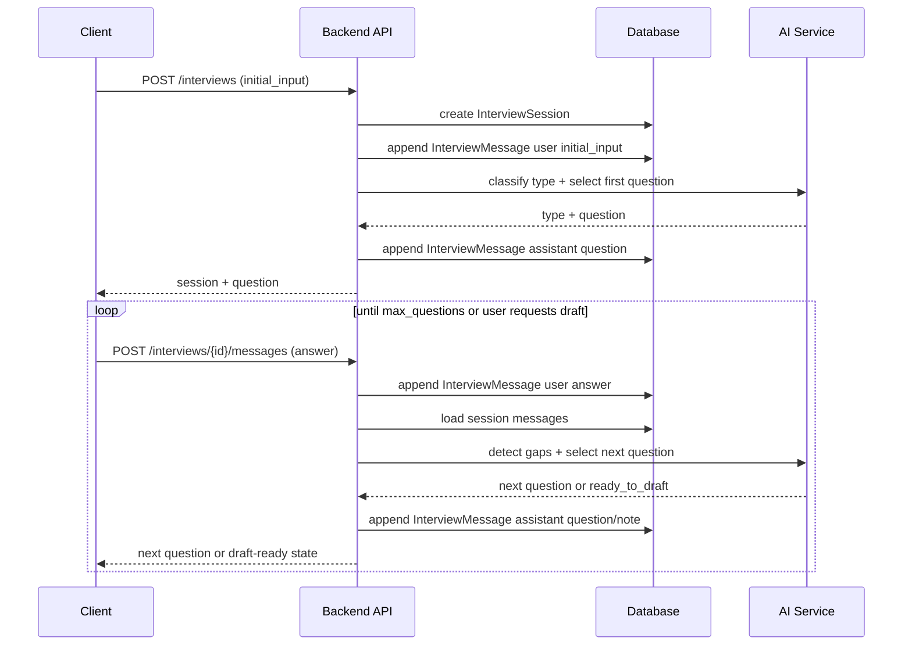
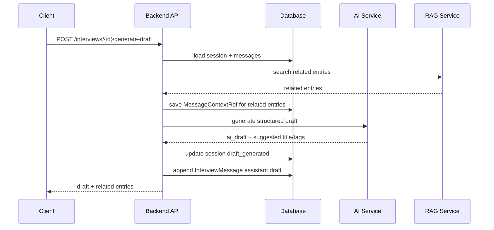
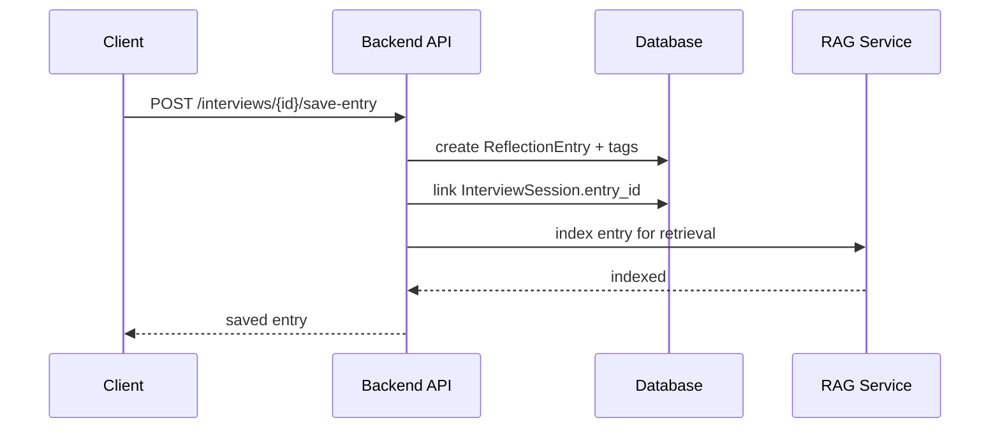
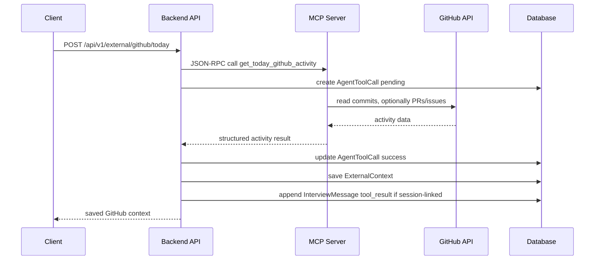

# 02. Architecture

이 문서는 `docs/01-product-planning.md`의 MVP 범위를 구현하기 위한 아키텍처 초안입니다.
현재 핵심 목표는 “질문 -> 답변 -> 초안 -> 저장” 기록 작성 루프를 먼저 완성하고, RAG/MCP/Agent를 그 위에 작은 기능으로 붙이는 것입니다.

## 1) 기술 스택 선택 이유

| 영역 | 선택 기술 | 선택 이유 | 대안 |
| --- | --- | --- | --- |
| Frontend | React + TypeScript | 과제 필수 조건인 React를 만족하고, 인터뷰 세션/목록/상세/작성 화면을 컴포넌트 단위로 관리하기 쉽다. | Next.js App Router |
| Backend | FastAPI | Python 기반이라 LLM, RAG, MCP Server, embedding 처리와 연결하기 쉽다. 2주 개인 MVP에서 API를 빠르게 만들기 좋다. | Next.js API Routes, NestJS, Spring Boot |
| Auth | JWT Bearer | 프론트/백엔드 분리 구조에서 구현과 API 문서화가 단순하고, 사용자별 기록 분리에 필요한 인증 상태를 명확히 다룰 수 있다. | Cookie Session |
| Database | PostgreSQL | 관계형 게시판 데이터와 사용자/댓글/태그/인터뷰 세션을 안정적으로 관리할 수 있고, 추후 pgvector 확장도 가능하다. | MariaDB, MySQL |
| Vector Search | pgvector 우선, 키워드/태그 fallback | PostgreSQL을 확정했으므로 embedding 기반 검색은 pgvector를 우선 검토한다. 구현이 지연되면 태그/키워드 검색으로 관련 기록 추천 경험을 먼저 제공한다. | ChromaDB, FAISS |
| LLM / Embedding | OpenAI API | 회고 유형 분류, 질문 선택, 초안 생성, embedding 생성에 사용한다. 한 provider로 통일해 MVP 구현과 환경변수 관리를 단순화한다. | Anthropic, Gemini 등 과제 허용 범위 내 모델 |
| MCP | 커스텀 MCP Server + GitHub API | 과제의 MCP Server 구현, JSON-RPC 요청/응답, 외부 서비스 연동 요구를 만족한다. | 공식 GitHub MCP Server 참고 또는 Post-MVP 도입 |
| Infra | 로컬 개발 우선, 배포 대상 추후 결정 | MVP는 데모 중심이므로 로컬 실행과 문서화가 우선이다. | Vercel/Render/Railway/Cloud VM |

확정된 항목은 Backend, Auth, Database, LLM/Embedding provider입니다. RAG는 `ReflectionEntry` 중심 검색으로 시작하고, Vector Search 구현은 pgvector 우선/fallback 허용으로 진행합니다. 배포 방식은 `docs/01-product-planning.md`의 오픈 질문과 함께 추가 결정합니다.

## 2) 시스템 구성



설명:

- 프론트 역할:
  - 로그인/회원가입 화면
  - 회고/트러블슈팅 목록, 작성, 상세 화면
  - 인터뷰 세션 UI
  - 태그/검색/페이징 UI
  - AI 질문, 초안, 관련 기록, GitHub 활동 근거 표시
- 백엔드 역할:
  - 인증과 사용자별 데이터 분리
  - 회고/트러블슈팅 글 CRUD
  - 댓글, 태그, 검색, 페이징 처리
  - 인터뷰 세션과 메시지 저장
  - LLM 호출을 통한 유형 분류, 질문 선택, 초안 생성
  - RAG 검색 요청과 결과 조립
  - MCP Server 호출 또는 MCP Server와의 연동 경계 관리
- 데이터 저장 방식:
  - 관계형 DB에는 사용자, 글, 댓글, 태그, 인터뷰 세션, 외부 맥락을 저장한다.
  - Vector Store에는 회고/트러블슈팅 기록 또는 외부 맥락의 검색용 embedding을 저장한다.
  - MVP에서 vector 구현이 지연되면 태그/키워드 검색 fallback을 사용한다.
- MCP Server 역할:
  - `get_today_github_activity` tool을 제공한다.
  - GitHub API를 read-only로 호출한다.
  - MVP에서는 오늘 커밋 목록을 중심으로 조회하고, PR/Issue는 가능하면 포함한다.
  - 커밋 diff 분석과 문제 원인 추정은 Post-MVP로 둔다.
  - 결과를 Agent가 사용할 수 있는 구조화 JSON으로 반환한다.

## 3) 레이어 구조

- UI Layer: 화면 렌더링, 폼 입력, 인터뷰 진행 상태 표시
- Route / Controller: HTTP 요청/응답 처리, 인증 검증
- Service: 비즈니스 로직, 회고 유형 분류, 인터뷰 상태 관리, 초안 생성 요청
- Repository: DB I/O, 검색 조건 조립, 페이지네이션
- AI Service: LLM prompt 구성, Agent 질문 선택, 초안 생성
- Agent State Machine: 회고 유형 분류, 누락 정보 탐지, 질문 선택, 초안 생성 상태 전이를 직접 관리
- RAG Service: 검색 대상 chunk 구성, embedding 생성, 관련 기록 top-k 검색
- MCP Client / MCP Server: MCP tool 호출, JSON-RPC 요청/응답, GitHub API 연동

현재 프로젝트 구조 예시:

```text
project-root/
├─ frontend/
│  ├─ src/
│  │  ├─ pages-or-routes/
│  │  ├─ components/
│  │  ├─ features/
│  │  └─ api/
│  └─ ...
├─ backend/
│  ├─ app/
│  │  ├─ api/
│  │  ├─ services/
│  │  ├─ repositories/
│  │  ├─ models/
│  │  ├─ schemas/
│  │  ├─ ai/
│  │  ├─ rag/
│  │  └─ mcp/
│  └─ ...
├─ docs/
└─ ...
```

실제 구조는 선택한 프레임워크에 맞춰 조정하되, 레이어 책임은 위 기준을 유지합니다.

## 4) 데이터 모델

핵심 엔티티만 먼저 정리합니다.

### Entity A. User

| 필드 | 타입 | 설명 | 필수 여부 |
| --- | --- | --- | --- |
| `id` | UUID / bigint | 사용자 식별자 | Yes |
| `email` | string | 로그인 이메일, 유니크 | Yes |
| `password_hash` | string | 해시된 비밀번호 | Yes |
| `name` | string | 표시 이름 | Yes |
| `created_at` | datetime | 생성 시각 | Yes |
| `updated_at` | datetime | 수정 시각 | Yes |

### Entity B. ReflectionEntry

| 필드 | 타입 | 설명 | 필수 여부 |
| --- | --- | --- | --- |
| `id` | UUID / bigint | 회고/트러블슈팅 글 식별자 | Yes |
| `user_id` | UUID / bigint | 작성자 | Yes |
| `title` | string | 기록 제목 | Yes |
| `type` | enum | `daily`, `trouble`, `decision`, `team_issue`, `learning` | Yes |
| `ai_draft` | text | AI가 생성한 초안 | No |
| `final_content` | text | 사용자가 검토/수정 후 저장한 최종 글 | Yes |
| `status` | enum | `draft`, `published`, `archived` | Yes |
| `created_at` | datetime | 생성 시각 | Yes |
| `updated_at` | datetime | 수정 시각 | Yes |

ReflectionEntry는 사용자가 최종 저장한 게시글에 집중한다. 사용자의 최초 입력과 인터뷰 원문은 `InterviewMessage(message_type = initial_input)` 및 이후 메시지 로그에 저장한다.
MVP에서는 초안은 `InterviewSession.draft_content`에 보관하고, 사용자가 저장하면 `ReflectionEntry.status = published`로 생성한다.

### Entity C. InterviewSession

| 필드 | 타입 | 설명 | 필수 여부 |
| --- | --- | --- | --- |
| `id` | UUID / bigint | 인터뷰 세션 식별자 | Yes |
| `user_id` | UUID / bigint | 세션 소유자 | Yes |
| `entry_id` | UUID / bigint nullable | 저장된 글과 연결되는 경우 참조 | No |
| `type` | enum | 추천 또는 선택된 기록 유형 | No |
| `status` | enum | `in_progress`, `draft_generated`, `saved`, `cancelled` | Yes |
| `initial_input` | text | 세션 시작 입력의 조회용 스냅샷. 원본은 InterviewMessage에 저장 | Yes |
| `question_count` | integer | Agent 질문 횟수 | Yes |
| `max_questions` | integer | 질문 최대 횟수, 기본 3~5 | Yes |
| `draft_content` | text nullable | 초안 생성 후 임시 저장되는 AI 초안 | No |
| `created_at` | datetime | 생성 시각 | Yes |
| `updated_at` | datetime | 수정 시각 | Yes |

MVP 정책:

- InterviewSession은 무제한 챗봇이 아니라 제한된 회고 인터뷰 세션이다.
- 사용자는 여러 번 답변할 수 있지만, Agent 질문은 기본 3개, 최대 5개로 제한한다.
- 사용자는 언제든 “초안 생성”을 요청할 수 있다.
- 초안 생성 후에도 원본 메시지들은 유지한다.

### Entity D. InterviewMessage

| 필드 | 타입 | 설명 | 필수 여부 |
| --- | --- | --- | --- |
| `id` | UUID / bigint | 메시지 식별자 | Yes |
| `session_id` | UUID / bigint | 인터뷰 세션 | Yes |
| `role` | enum | `user`, `assistant`, `system`, `tool` | Yes |
| `message_type` | enum | `initial_input`, `question`, `answer`, `tool_result`, `draft`, `note` | Yes |
| `sequence` | integer | 세션 안에서의 메시지 순서 | Yes |
| `content` | text | 메시지 내용 | Yes |
| `metadata` | json | 질문 유형, 참조 기록, tool 호출 요약 등 | No |
| `created_at` | datetime | 생성 시각 | Yes |

InterviewMessage는 append-only 로그처럼 사용한다. 질문/답변을 하나의 row에 묶지 않고, user/assistant/tool 메시지를 시간순으로 쌓는다. 이렇게 해야 여러 턴 대화, tool 호출 결과, 초안 생성 기록을 같은 구조로 다룰 수 있다.

### Entity E. AgentToolCall

| 필드 | 타입 | 설명 | 필수 여부 |
| --- | --- | --- | --- |
| `id` | UUID / bigint | tool 호출 식별자 | Yes |
| `session_id` | UUID / bigint | 연결된 인터뷰 세션 | Yes |
| `message_id` | UUID / bigint nullable | tool 호출을 유발한 assistant 메시지 | No |
| `tool_name` | string | 호출한 tool 이름. 예: `get_today_github_activity` | Yes |
| `input_json` | json | tool 입력값 | Yes |
| `output_json` | json | tool 결과값 | No |
| `status` | enum | `pending`, `success`, `failed` | Yes |
| `error_message` | text | 실패 사유 | No |
| `created_at` | datetime | 생성 시각 | Yes |

AgentToolCall은 RAG, MCP, LLM function calling 등 Agent가 외부 도구를 호출한 흔적을 남긴다. MVP에서는 GitHub MCP 호출과 RAG 검색 요청을 추적하는 데 사용한다.

### Entity F. MessageContextRef

| 필드 | 타입 | 설명 | 필수 여부 |
| --- | --- | --- | --- |
| `id` | UUID / bigint | 참조 기록 식별자 | Yes |
| `session_id` | UUID / bigint | 연결된 인터뷰 세션 | Yes |
| `message_id` | UUID / bigint nullable | 이 참조를 사용한 메시지 | No |
| `source_type` | enum | `reflection_entry`, `external_context`, `tool_call` | Yes |
| `source_id` | UUID / bigint | 참조한 원본 ID | Yes |
| `relevance_score` | float | 관련도 점수 | No |
| `reason` | string | 참조 이유 또는 요약 | No |
| `created_at` | datetime | 생성 시각 | Yes |

MessageContextRef는 AI 질문이나 초안이 어떤 과거 기록, 외부 맥락, tool 결과를 참고했는지 추적하기 위한 테이블이다. UI에서는 “참고한 기록”으로 보여줄 수 있다.

### Entity G. Comment

| 필드 | 타입 | 설명 | 필수 여부 |
| --- | --- | --- | --- |
| `id` | UUID / bigint | 댓글 식별자 | Yes |
| `entry_id` | UUID / bigint | 대상 글 | Yes |
| `user_id` | UUID / bigint | 작성자 | Yes |
| `content` | text | 댓글 내용 | Yes |
| `created_at` | datetime | 생성 시각 | Yes |
| `updated_at` | datetime | 수정 시각 | Yes |

### Entity H. Tag / EntryTag

| 필드 | 타입 | 설명 | 필수 여부 |
| --- | --- | --- | --- |
| `tags.id` | UUID / bigint | 태그 식별자 | Yes |
| `tags.name` | string | 태그명, 유니크 | Yes |
| `entry_tags.entry_id` | UUID / bigint | 글 식별자 | Yes |
| `entry_tags.tag_id` | UUID / bigint | 태그 식별자 | Yes |

MVP에서는 별도 태그 생성 API를 먼저 노출하지 않는다. 글 생성/수정 요청에서 `tag_names` 배열을 받고, 서버가 없는 태그를 생성한 뒤 `entry_tags`를 갱신한다.

### Entity I. ExternalContext

ExternalContext는 서비스 내부 기록이 아닌 외부 시스템에서 가져온 맥락을 저장하는 엔티티다.
MVP에서는 GitHub MCP가 가져온 오늘 커밋 중심의 활동을 저장하는 용도로 사용한다. 가능하면 PR/Issue도 함께 저장한다. 이 데이터는 AI 질문/초안 생성의 참고 자료로 쓰이고, 사용자에게 “AI가 참고한 GitHub 활동”으로 보여줄 수 있다.

Post-MVP에서는 같은 구조를 ChatGPT/Gemini 상담 기록, 사용자가 직접 붙여넣은 메모, 로컬 파일, 브라우저에서 선택한 URL 등으로 확장할 수 있다.

| 필드 | 타입 | 설명 | 필수 여부 |
| --- | --- | --- | --- |
| `id` | UUID / bigint | 외부 맥락 식별자 | Yes |
| `user_id` | UUID / bigint | 소유자 | Yes |
| `session_id` | UUID / bigint nullable | 연결된 인터뷰 세션 | No |
| `source` | enum | MVP: `github`. Post-MVP 후보: `manual`, `chatgpt`, `file`, `browser` | Yes |
| `title` | string | 외부 맥락 제목 | Yes |
| `content` | text | 저장된 외부 맥락 내용 | Yes |
| `metadata` | json | 커밋 SHA, URL, repo, 조회 기간 등 | No |
| `created_at` | datetime | 생성 시각 | Yes |

MVP 저장 예시:

```json
{
  "source": "github",
  "title": "2026-06-08 GitHub activity",
  "content": "auth API 관련 커밋 2개, schema 수정 커밋 1개",
  "metadata": {
    "owner": "sisu",
    "repo": "dev-reflection-board",
    "since": "2026-06-08T00:00:00+09:00",
    "until": "2026-06-08T23:59:59+09:00",
    "commits": [
      {
        "sha": "abc123",
        "message": "feat: add auth signup api"
      }
    ]
  }
}
```

### Entity J. EmbeddingRecord

EmbeddingRecord는 RAG 검색을 위한 인덱스 엔티티다.
원본 데이터 자체를 저장하는 테이블이 아니라, 검색 대상 텍스트 조각과 그 embedding vector를 저장한다.

MVP에서는 최종 저장된 `ReflectionEntry`만 검색 대상으로 삼는다. 구체적으로 `title`, `final_content`, `tags`를 chunking 또는 검색용 텍스트로 구성한다.
Post-MVP에서는 인터뷰 메시지의 주요 내용, GitHub ExternalContext, AI 상담 기록, 학습 메모, 파일 import, 브라우저 URL 요약 등으로 검색 대상을 확장할 수 있다.

| 필드 | 타입 | 설명 | 필수 여부 |
| --- | --- | --- | --- |
| `id` | UUID / bigint | embedding 식별자 | Yes |
| `owner_type` | enum | MVP: `entry`. Post-MVP 후보: `interview_message`, `external_context`, `imported_conversation`, `file_context` | Yes |
| `owner_id` | UUID / bigint | 검색 대상 원본 ID | Yes |
| `chunk_text` | text | embedding 대상 텍스트 | Yes |
| `embedding_vector` | vector / blob | embedding 벡터 | Yes |
| `metadata` | json | 타입, 태그, 생성 시각 등 검색 보조 정보 | No |
| `created_at` | datetime | 생성 시각 | Yes |

운영 기준:

- `owner_type`과 `owner_id`는 원본 데이터 위치를 가리킨다.
- `chunk_text`는 검색에 사용할 텍스트 스냅샷이다.
- 원본 글이나 외부 맥락이 수정되면 관련 embedding을 재생성한다.
- MVP에서 vector store 구현이 지연되면 이 엔티티는 설계만 두고 태그/키워드 검색 fallback을 먼저 사용할 수 있다.
- MVP RAG API는 `POST /api/v1/rag/search`를 우선 사용한다.

## 5) DB 스키마 / 정합성 규칙

- 유니크해야 하는 값:
  - `users.email`
  - `tags.name`
  - `entry_tags(entry_id, tag_id)`
- 삭제 시 연관 데이터 처리 방식:
  - User 삭제는 MVP에서 직접 제공하지 않는다.
  - ReflectionEntry 삭제 시 댓글, 태그 연결, 인터뷰 연결, embedding은 함께 삭제하거나 soft delete 기준을 정한다.
  - InterviewSession 삭제는 MVP에서 제공하지 않고, 취소 상태로 관리한다.
  - ExternalContext는 사용자가 직접 삭제할 수 있어야 하며, 관련 embedding도 삭제한다.
- 동시성/중복 방지 규칙:
  - 동일 세션에서 `max_questions`를 초과해 Agent 질문을 생성하지 않는다.
  - InterviewMessage는 `session_id + sequence` 기준으로 순서가 유니크해야 한다.
  - 동일 글에 같은 태그를 중복 연결하지 않는다.
  - 동일 원본에 대해 embedding을 재생성할 때 기존 embedding을 삭제하거나 version을 갱신한다.
- 상태 전이 규칙:
  - InterviewSession: `in_progress -> draft_generated -> saved`
  - InterviewSession: `in_progress -> cancelled`
  - ReflectionEntry: `draft -> published -> archived`
  - MVP에서는 ReflectionEntry를 저장 시 `published`로 생성한다. 초안 상태는 InterviewSession에서 관리한다.
- 권한 규칙:
  - 사용자는 자신의 글, 인터뷰 세션, 외부 맥락만 수정/삭제할 수 있다.
  - 공개/공유 기능은 MVP 범위에서 제외한다.
  - GitHub token은 서버 환경변수로 관리하고 DB에 평문 저장하지 않는다.
- 대화 저장 규칙:
  - 사용자/AI/tool 메시지는 InterviewMessage에 append-only로 저장한다.
  - 사용자의 최초 입력 원본은 `InterviewMessage(role = user, message_type = initial_input, sequence = 1)`에 저장한다.
  - 초안 생성은 단일 Q/A가 아니라 InterviewMessage에 누적된 여러 턴의 대화를 기반으로 수행한다.
  - tool 호출 결과는 AgentToolCall에 저장하고, 사용자에게 보여줄 요약은 InterviewMessage 또는 ExternalContext에 연결한다.
- API 규칙:
  - 응답 포맷은 `success/data/error` 래퍼를 사용한다.
  - JSON key는 `snake_case`를 사용한다.
  - 인증은 JWT Bearer를 사용한다.
  - 인터뷰 메시지 저장 API는 사용자 답변을 저장한 뒤 다음 질문 또는 `draft_ready` 상태를 반환한다.
- Agent 구현 규칙:
  - MVP Agent는 LangGraph 없이 직접 상태 머신으로 구현한다.
  - 상태는 `CLASSIFY_TYPE`, `EXTRACT_FACTS`, `DETECT_GAPS`, `ASK_QUESTION`, `READY_TO_DRAFT`, `GENERATE_DRAFT`, `DONE` 중심으로 관리한다.
  - LangGraph 또는 유사 프레임워크는 Post-MVP에서 검토한다.

## 6) 핵심 시퀀스 다이어그램

모든 기능을 그리지 말고, 리스크 높은 흐름만 우선 작성합니다.

### Flow A. 여러 턴 인터뷰 세션 진행



### Flow B. 누적 대화를 바탕으로 초안 생성



### Flow C. 초안을 게시글로 저장



### Flow D. GitHub MCP 활동 조회



## 7) 운영/배포 메모

- 실행 환경:
  - MVP는 로컬 개발과 발표 데모를 우선한다.
  - 배포 대상은 구현 이후 결정한다.
- 환경 변수:
  - `DATABASE_URL`
  - `JWT_SECRET`
  - `OPENAI_API_KEY`
  - `GITHUB_TOKEN`
  - `GITHUB_OWNER`
  - `GITHUB_REPO`
  - `MCP_SERVER_URL` 또는 로컬 MCP server 실행 정보
- 배포 전략:
  - 프론트/백엔드 분리 배포 또는 단일 앱 배포는 선택한 프레임워크에 따라 결정한다.
  - DB는 PostgreSQL을 사용한다.
  - MCP Server는 백엔드 내부 모듈로 시작하거나 별도 프로세스로 띄운다.
- 로깅/모니터링 계획:
  - API 요청 실패와 인증 실패 로그를 남긴다.
  - LLM 호출 실패, RAG 검색 실패, MCP tool 호출 실패를 구분해 기록한다.
  - 외부 API key 값은 로그에 남기지 않는다.
  - AI 응답은 사용자 데이터이므로 민감 정보로 취급한다.
